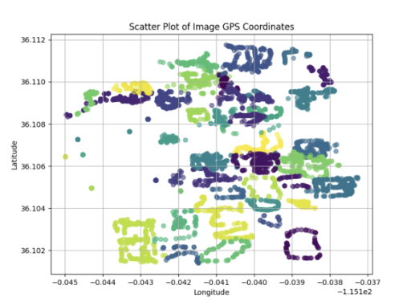

# Rebel Locate 🔍
a UNLV-based geolocator, using a self-captured database of over 6000+ images. Utilizing machine learning algorithm, a dynamically trained Convolutional Neural Network, and extracted coordniate metadata for image recognition and scene labeling to accurately predict an image location.

🔗 **[Demo](https://docs.google.com/presentation/d/1KvvYFAokP8HvaATkJNQrT9pRTmb60Vqf/edit?rtpof=true&sd=true)**
📄 **[Report](https://docs.google.com/document/d/17bAR715s4y0F84yz48RcYhYhvDnf9tYT5Q50nIaxMR4/edit?usp=sharing)** 

## Model Overview 💾

Rebel Locate utilizes a three-stage machine learning pipeline consisting of:

1. **EXIF Metadata Extraction**
2. **K-Nearest Neighbors (KNN)**
3. **Convolutional Neural Network (CNN)**

Each stage narrows the prediction space, improving both efficiency and classification accuracy.

## 1. EXIF Metadata Extraction

Every image contains embedded EXIF metadata which in turn holds hidden information for each photo, specifically the latitude and longitude for all photos. These coordinates are then extracted and converted into decimal format before being organized into a Pandas DataFrame alongside their corresponding building labels.

- To visualize the collected dataset, Matplotlib was used to generate a scatter plot of all images and their locations across the UNLV campus as shown below.

<p align="center">
  
</p>

## 2. K-Nearest Neighbors (KNN)

The extracted GPS coordinates are used to predict the building in which an image was captured.

- A K-Nearest Neighbors classifier compares the input image coordinates against the existing dataset, assigning the building label based on nearby samples. K-Fold Cross Validation is performed to determine the optimal value of **K**, to then calculate the distance from the image coordinates and the newly found closest landmark.

- Once KNN has indetified the most probable building, only the images related to said building will be used in the next stage of the module, CNN.

## 3. Convolutional Neural Network (CNN)

After the building has been predicted, Rebel Locate performs room type classification using a Convolutional Neural Network (CNN).

- The model utilizes **MIT's Places365 pretrained ResNet-18 weights** through transfer learning. Rather than training on the complete campus dataset, the CNN dynamically trains only using the predicted building's directory.

- The number of output classes is predetermined for each building, and is automatically chosen by CNN after building identifiction is complete (for example: classroom, hallway, lounge, stairwell, etc.).

- An 80/20 training split is used, and both building and room classification accuracies are displayed after training.

# Dataset 📈

All images were personally collected across the UNLV campus.

### Rebel Locate Dataset

**Dataset:** [Rebel Locate Dataset](https://drive.google.com/drive/u/4/folders/1_shwU9ab9lqalvdD6KOODgHzUmMU253G)  
- 6,000+ images
- 50 campus buildings
- Dynamic building prediction using GPS coordinates
- 11 unique building specific indentification labels

## Example Building Dataset

### Carol C. Harter Classroom Building Complex (CHB)

| Image Name            | Building_Name    | Label        |
| --------------------- | ---------------- | ------------ |
| `IMG_2853.jpg`        | CHB              | outside      |
| `IMG_2887.jpg`        | CHB              | outside      |
| `IMG_2942.jpg`        | CHB              | parking      |
| `IMG_3151.jpg`        | CHB              | hallway      |
| `IMG_3152.jpg`        | CHB              | hallway      |
| `IMG_3378.jpg`        | CHB              | stairwell    |
| `IMG_3411.jpg`        | CHB              | outside      |
| `IMG_3890.jpg`        | CHB              | classroom    |
| `IMG_3891.jpg`        | CHB              | classroom    |
| `IMG_4021.jpg`        | CHB              | lobby        | 
| `IMG_4022.jpg`        | CHB              | lobby        |
| `IMG_4030.jpg`        | CHB              | bathroom     |
| `IMG_4048.jpg`        | CHB              | elevator     |
| `IMG_4050.jpg`        | CHB              | classroom    |

# Project Structure 📁
```
Rebel-Locate/
│
├── Image datasets/
│   ├── BEH/
│   ├── CBC/
│   ├── HOS/
│   └── ...
│          ├── Outside/
│          ├── Lounge/
│          ├── Stairwell/
│          ├── Hallway/
│          ├── Classroom/
│          └── ...
├── models/
│   ├── knn.py
│   ├── cnn.py
│   ├── coordExtract.py
│   └── main.py
└──
```
